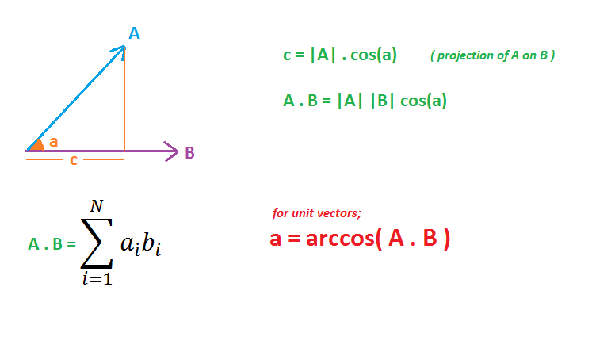

# ***Vector-dot-product***

'''
#include<iostream>
#include<vector>
using namespace std

double dotproduct(const vector<double>& A,const vector<double>& B)
{
  double result=0.0;
  for( int i=0;i<A.size();++i)
  {
     resukt+= A[i]*B[i];
   }
  return result;

}

int main()
{
  vector<double> vec1={1.0,2.0,3.0};
  vector<double> vec2={4.0,5.0,6.0};
  double result= dotproduct(vec1,vec2);
  cout<<"Dot product : "<<result <<endl;
  return 0;
}
'''
>Mathematical Expression
$$ \mathbf{A} \cdot \mathbf{B} = \sum_{i=1}^{n} A_i B_i $$

###Link
[google](https://www.google.co.in)

###List
1. If vectors are orthogonal dot product is 0.
2. At 180 degree dot product is minimum.
3. At 0 degree dot product is maximum.

###Alert
>[!NOTE]
>Magnitude of vectors cannot be negative.

###Table
|---------------------|-----------------|------------------|
|       Version       | Time complexity | Space Complexity |
|---------------------|-----------------|------------------|
|      Basic Loop     |       O(n)      |      O(1)        |
|---------------------|-----------------|------------------|
|parallel Computation |     O(log n)    |      O(1)        |
|---------------------|-----------------|------------------|

###Footnotes
[^1] The vector-dot-product

###Image

 

